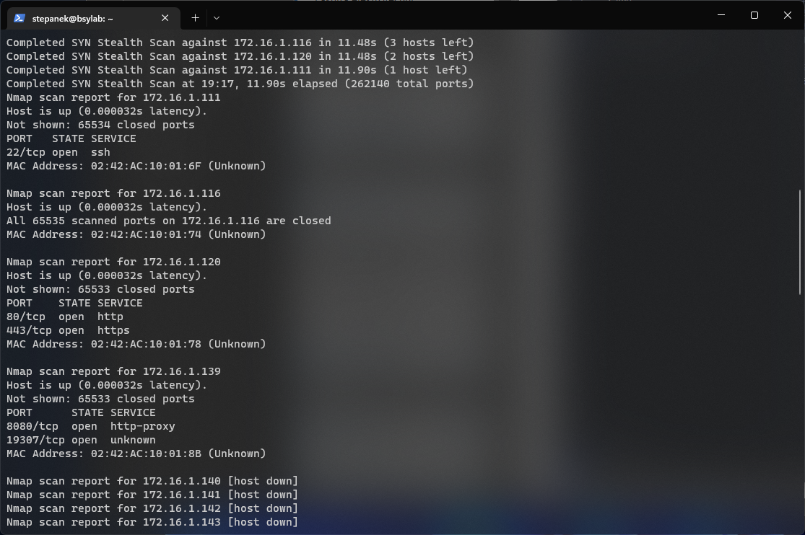
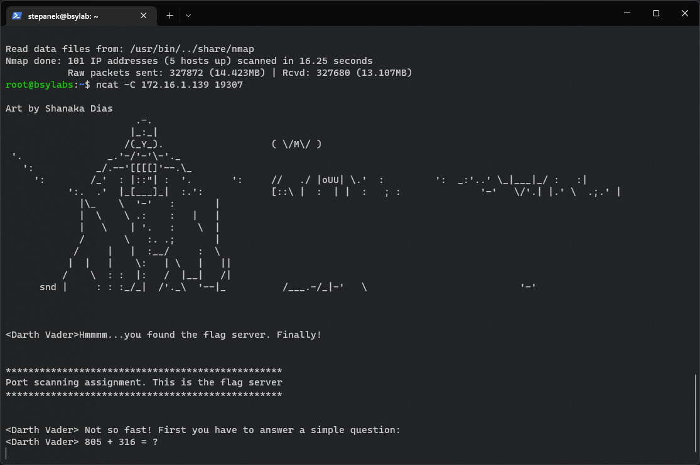
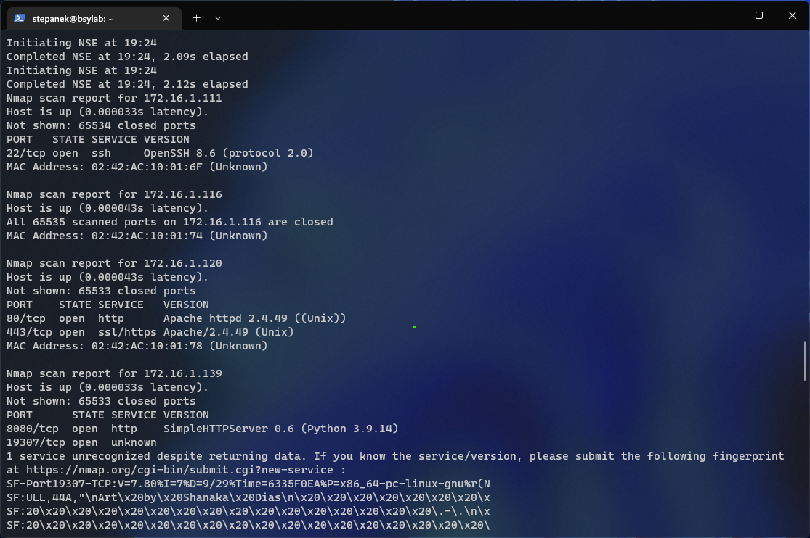

# Assignment 2

## ETag
We ran a code scan for all TCP ports within the range given IP address range:

``nmap -sS -n -v 172.16.1.100-200 -p-``

This gave us the result.

After failed attempts with ``ncat`` to the HTTP servers, which were baits, we tried:

``ncat -C 172.16.1.139 19307``

where we knew we were at the right place.

After simple math addition, we got to the ETag.

## Highest TCP port number
With the command, we tried to run the scan for all running services over the TCP in the given IP range. This approach is vulnerable to an HTTP server running over UDP.

``nmap -sV -n -v 172.16.1.100-200 -p-``

This told us that there is an HTTP server on port 8080. We tried it, and it worked.

## UDP services
