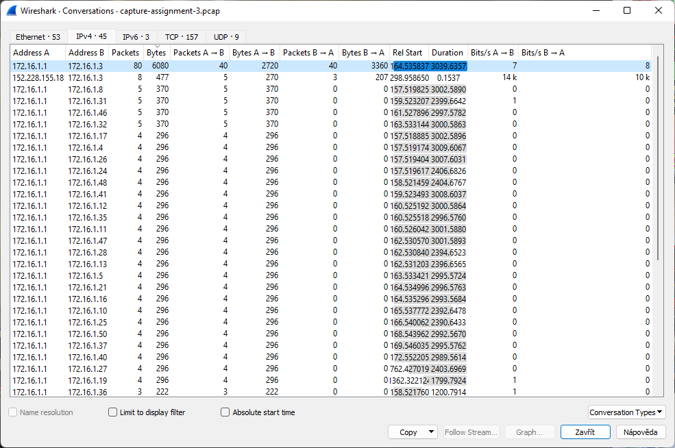
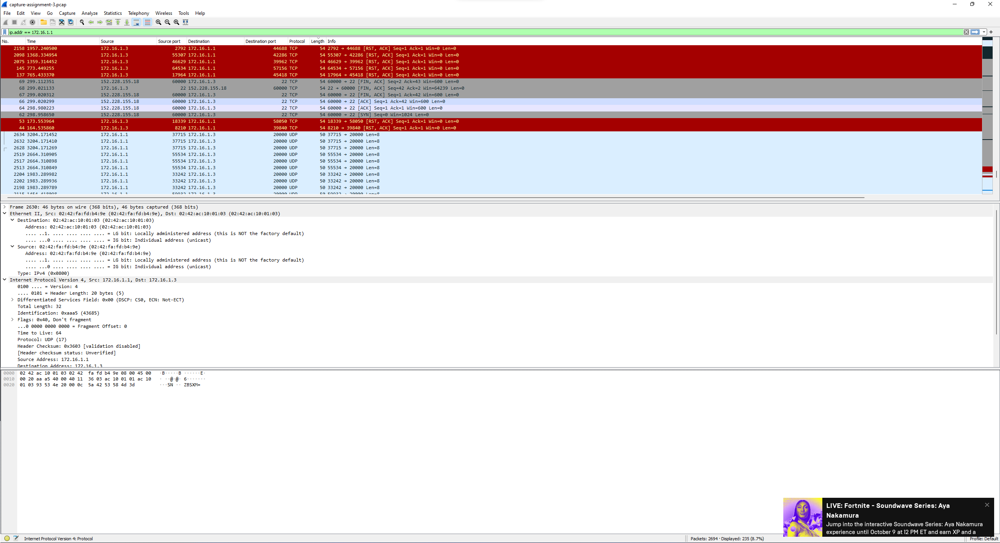
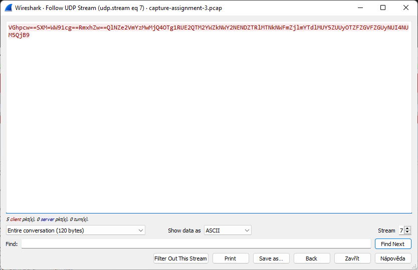
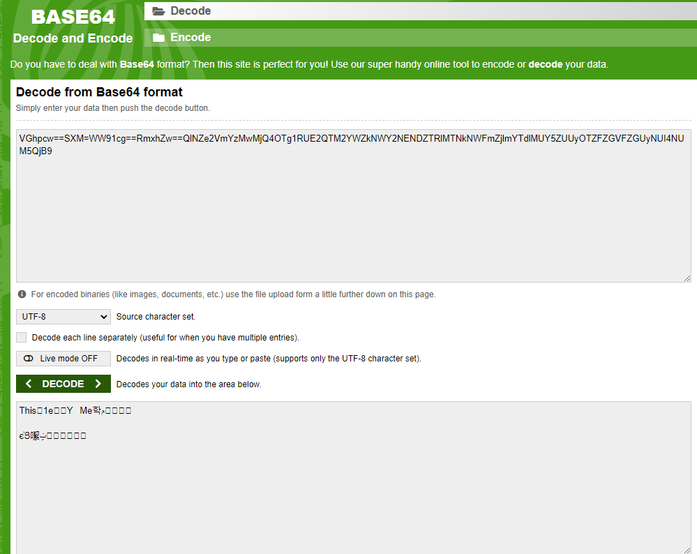
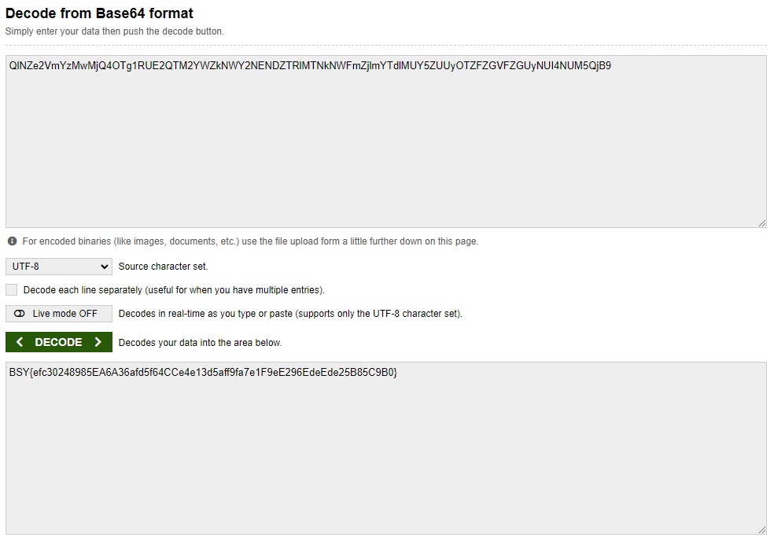
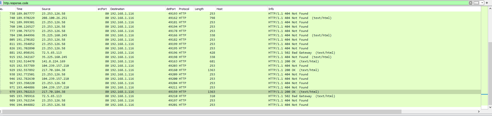
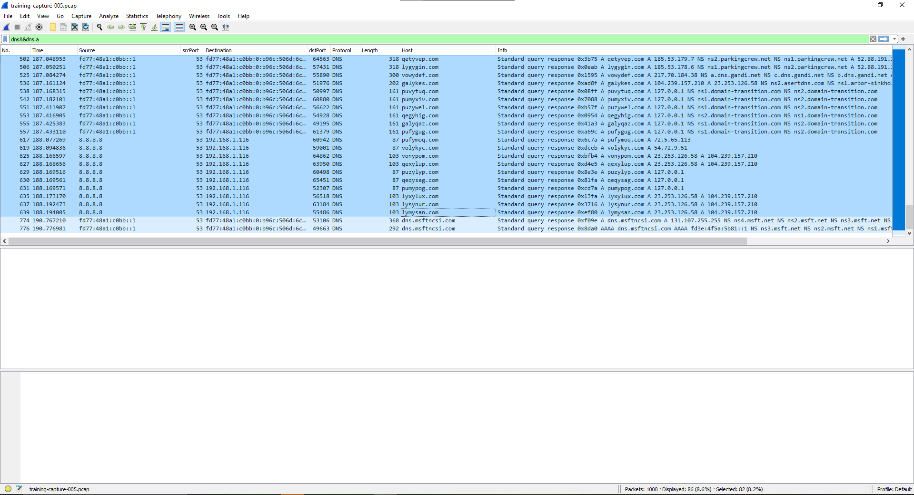

# Assignment 3

## ETag
We started by capturing the network for an hour on 6th October at 20:04 and measured for an hour. Afterwards, we transferred the file to a local computer and fired up Wire Shark.

There we started by analysing the Conversations window. We guessed that the token would be hidden as an IPv4 communication. We sorted the table by transfered bytes, since the ETag will likely be hidden in meaningful communication.

Naturally, we started from the largest, and hence we focused our efforts on the IP `172.16.1.1`.

We used Wireshark filter `ip.addr == 172.16.1.1`.

We have seen TCP, UDP, as well as some other traffic types. We tried to follow the TCP stream, but it did not make any sense. Then we tried to follow the UDP stream and were greeted with this suspicious string. 

In the assignment, there is a statement that the ETag might be encoded, so this string immediately caught our attention. We searched for a string decoder online and were greeted with a Base64 decoder. We have tried it with our string and got this even more suspicious text.

It was improbable that we got the English word "This" by accident, so we have tried to tinker with it a bit more. After a while, we tried to remove the whole part with the equal signs and got our ETag.

## In the service of others
We used Wireshark to filter out the responses with HTTP codes. Used: `http.response.code` filter. Found those which had HTTP 200.
 

## Name your poison
We used Wireshark to inspect DNS traffic. We applied the `dns&&dns.a` filter to see dns A type related traffic. Marked those which had suspicious requests (looked like an attempt to flood the cache of dns)
 