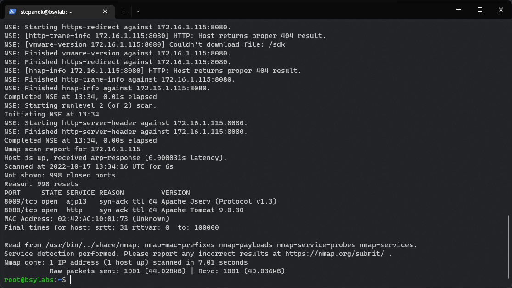
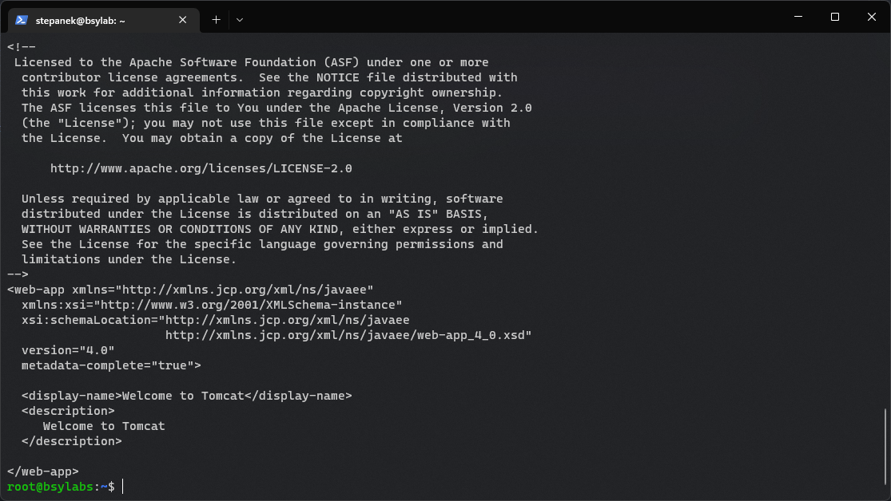
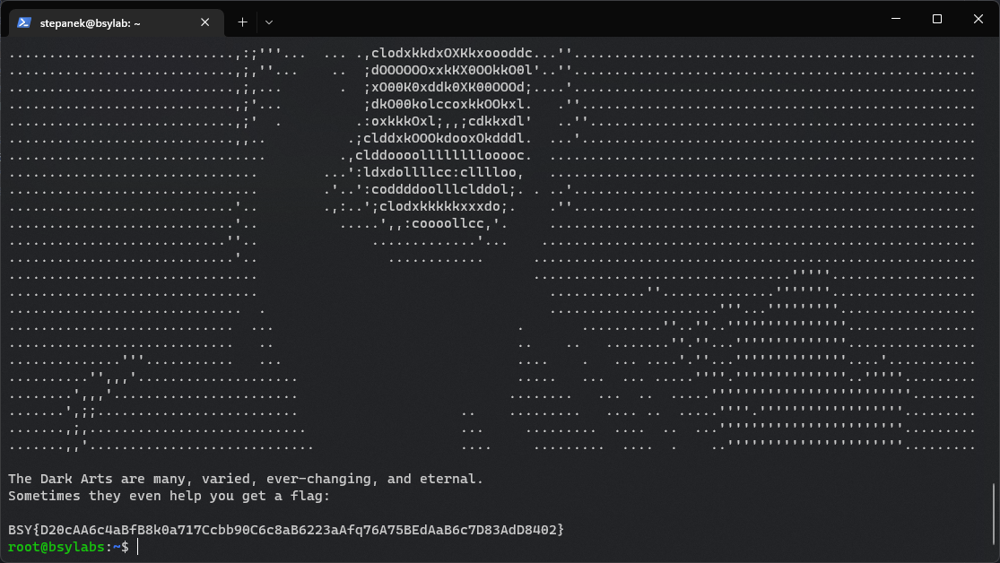

# Assignment 4
## Mrs Norris
In this assignment, we were given the IP of the vulnerable server. This ease our work. We began with a TCP service scan.

``nmap -v -n -d -sS -sV 172.16.1.115``

This told us that they are two services running. Apache Tomcat and Apache Jserv. Jserv is a companion service to Tomcat. The Tomcat service is in version ``7.0.30``. We started googling to find out if it was any vulnerable.

At first, we found vulnerability ``CVE-2020-13943``, but according to the description, it is not that severe, and we had no idea how to take advantage of it, so we kept googling.

Then we discovered that many Apache Tomcat versions, including ours, were vulnerable to ``CVE-2020–1938 (Ghostcat)``.

We began our efforts.

We searched GitHub for Ghostcat exploit and found [this tool](https://github.com/00theway/Ghostcat-CNVD-2020-10487). We downloaded the script and gave it a shot with the command.

``python3 ajpShooter.py http://172.16.1.115 8009 /WEB-INF/web.xml read``

This gave us this result, so we figured out the vulnerability was present.

The only issue was that the flag was not present. We began the experiment, and frankly, we got stuck as we couldn't find any hint of the flag location.

Finally, we tried the command below, which gave us the flag.

``python3 ajpShooter.py http://172.16.1.115 8009 /WEB-INF/flag read``

