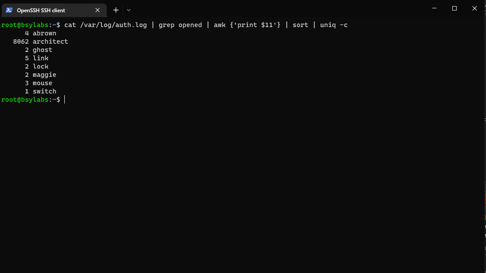
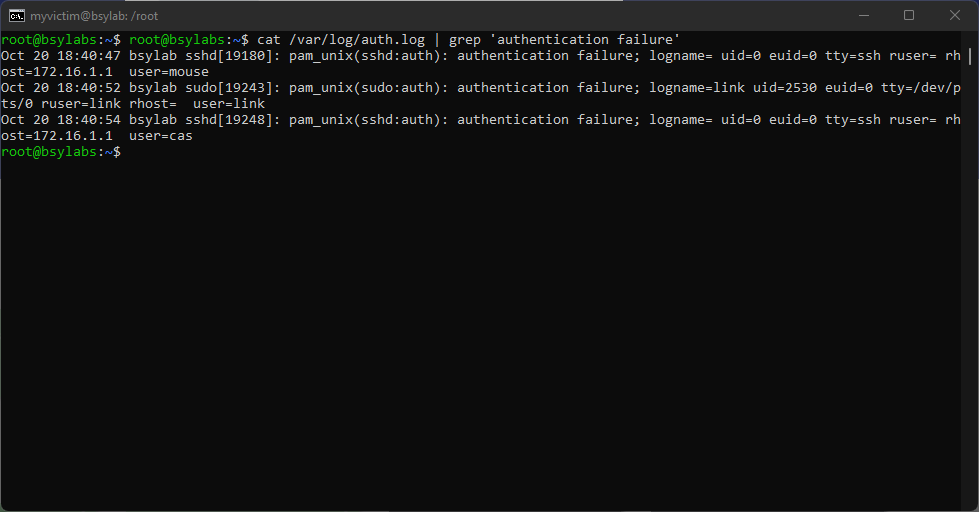
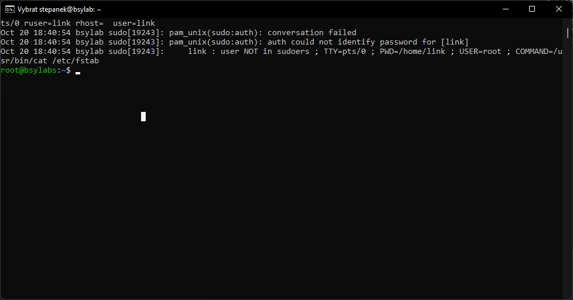
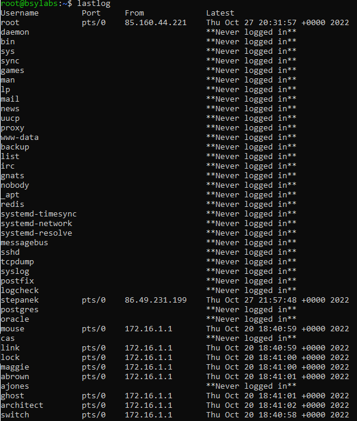
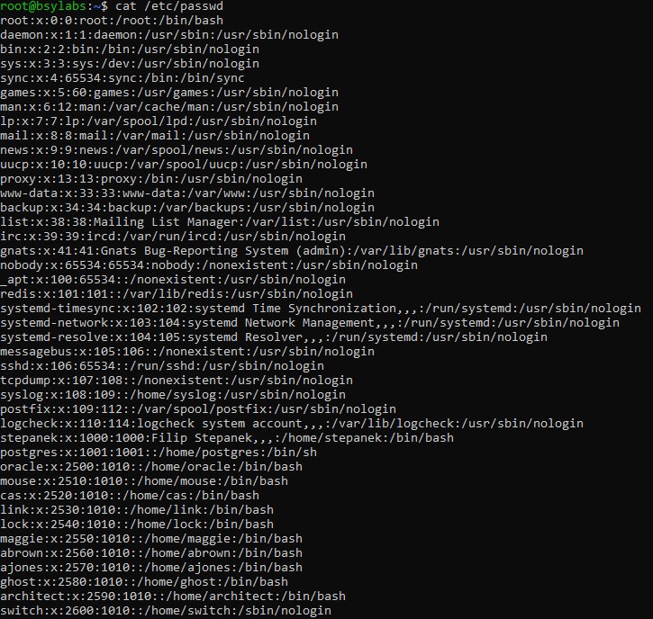

# Assignment 5

## Knock Knock...
We inspected the `/var/log/auth.log` file and looked for the successful logins.
We used this command to filter out the usernames with the number of logins: `cat /var/log/auth.log | grep opened | awk {'print $11'} | sort | uniq -c`

We got the following results:

## Never send a human to do a machine's job
We knew we were interested in the authentication log, which we can find in `/var/log/auth.log`. Also, we knew that we were looking for authentication failures. We put this together and composed this command:

`cat /var/log/auth.log | grep 'authentication failure`

From which we received this output:

We can observe that there were three failed attempts, but one of them was from user 'link', who is not a Matrix character. So we tried number 2, and it was the correct answer.

## The Chosen One
We are interested in failed unauthorized Sudo commands. We know that those incidents are logged in  `/var/log/auth.log`. We created this command and executed it:

`cat /var/log/auth.log | grep "Sudo"`

As we can see in the output, the failed command was `/usr/bin/cat /etc/fstab`, which was indeed the correct flag.

## A sentinel for every man, woman, and child
We assumed that there exist malicious users. We checked this with the command `last log`, which showed us that there was some activity by unrecognized users.

We listed all existing users with the command `cat /etc/passwd`, which showed us even more suspicious users.

Conveniently, all the Matrix-related users shared group `construct` with `gid 1010`. That eased up the identification. We deleted the users and group with a shell script containing the following:

`deluser mouse` 
`deluser link` 
`deluser lock` 
`deluser maggie` 
`deluser abrown` 
`deluser ghost` 
`deluser architect` 
`deluser switch` 
`deluser ajones` 
`deluser cas` 
`deluser oracle` 
`delgroup construct`

Finally, we were greeted with the file `.redpill.flag.`